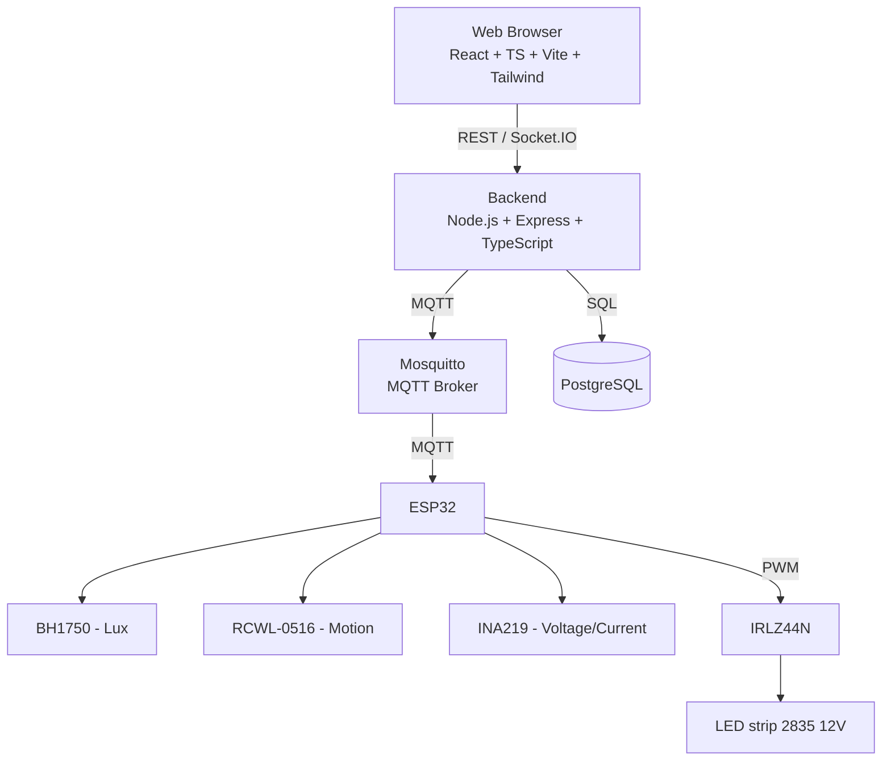
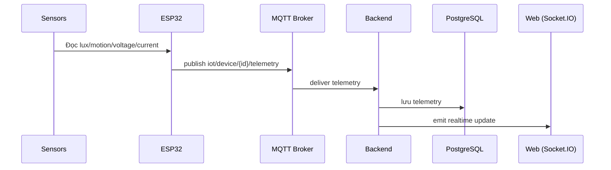
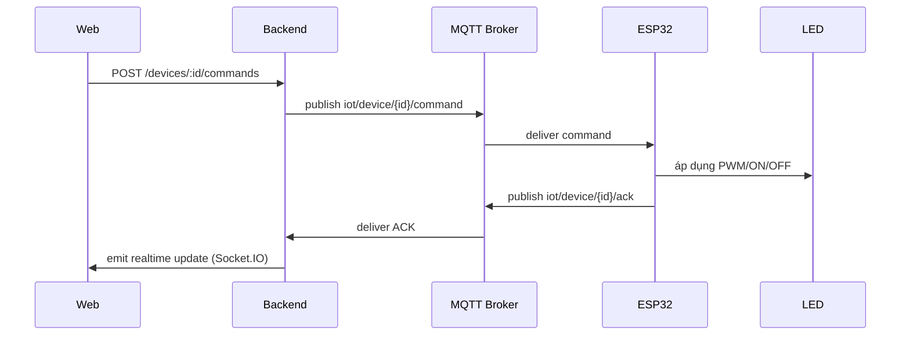
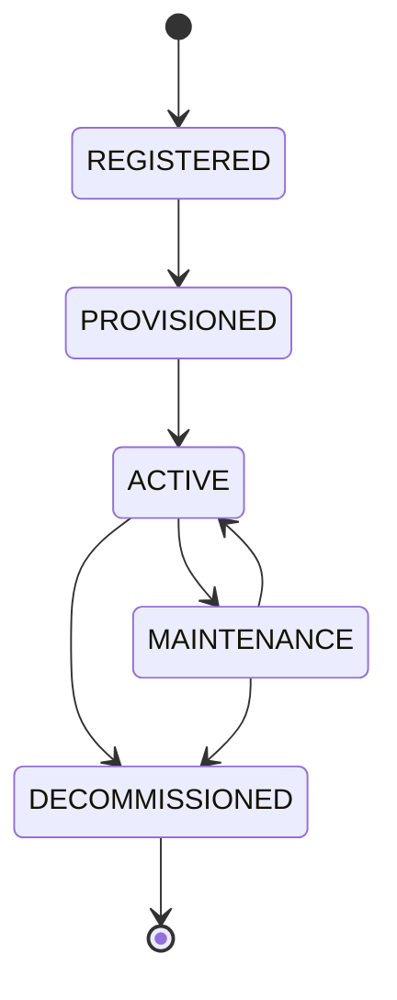

# ARCHITECTURE — Smart Lighting System

> Tài liệu này mô tả **HOW** hệ thống được tổ chức ở mức kiến trúc. Không phải source code documentation — chi tiết implementation nằm trong code và các docs khác (`API_SPEC.md`, `DATABASE.md`).

## 1. Architecture Overview

Hệ thống sử dụng kiến trúc **modular monolith** (không chia thành microservice).

```text
Web Browser (React + TypeScript + Vite + Tailwind CSS)
   │  REST / Socket.IO
   ▼
Backend (Node.js + Express + TypeScript)
   │                    │
   │ MQTT                │ SQL
   ▼                    ▼
Mosquitto (MQTT Broker)   PostgreSQL (Database)
   │  MQTT
   ▼
ESP32
   ├─ BH1750 → Lux
   ├─ RCWL-0516 → Motion
   ├─ INA219 → Voltage / Current
   └─ PWM → IRLZ44N → LED 12V
```

- **PostgreSQL:** database quan hệ dùng cho dữ liệu quản lý (user, device, telemetry, command, alert, audit log); dùng kiểu JSONB cho `adaptive_config`.
- **Socket.IO:** chỉ dùng để đẩy dữ liệu thay đổi theo thời gian thực từ Backend đến Web (không dùng cho giao tiếp Backend ↔ ESP32).

## 2. Architecture Layers

| Layer | Mô tả |
|---|---|
| **Device / Hardware** | ESP32 + cảm biến (BH1750, RCWL-0516, INA219) + cơ cấu chấp hành (IRLZ44N + LED strip 2835 12V). |
| **IoT Communication** | MQTT qua Mosquitto Broker, mô hình publish/subscribe giữa ESP32 và Backend. |
| **Backend** | Node.js + Express + TypeScript: xử lý nghiệp vụ, auth/RBAC, quản lý user/device, xử lý telemetry, xử lý command, alert engine, MQTT client, Socket.IO server. |
| **Database** | PostgreSQL: lưu trữ toàn bộ dữ liệu quản lý và vận hành. |
| **Frontend** | React + TypeScript + Vite + Tailwind CSS: giao diện Web, dashboard, biểu đồ (Recharts). |
| **Deployment** | Docker Compose hỗ trợ triển khai môi trường (Backend, Mosquitto, PostgreSQL...). |

## 3. Technology Stack

| Lớp | Công nghệ |
|---|---|
| MCU | ESP32 |
| Firmware | C++ / PlatformIO / Arduino Framework |
| IoT Protocol | MQTT v3.1.1 |
| MQTT Broker | Mosquitto |
| Backend | Node.js 24 LTS / Express 5 / TypeScript |
| MQTT client (backend) | MQTT.js |
| Database | PostgreSQL 18 |
| Authentication | JWT |
| Password Hash | bcryptjs |
| Frontend | React / TypeScript / Vite |
| UI | Tailwind CSS |
| Chart | Recharts |
| Realtime | Socket.IO |
| Deployment | Docker Compose |
| Version Control | Git / GitHub |

> Không tự thay thế công nghệ trong bảng trên khi thực hiện task.

## 4. Hardware Architecture

| Linh kiện | Vai trò |
|---|---|
| ESP32 | MCU + Wi-Fi + MQTT client |
| BH1750 (GY-302) | Đo cường độ ánh sáng (Lux) |
| RCWL-0516 | Phát hiện chuyển động |
| INA219 (MCU-219) | Đo điện áp, dòng điện, công suất |
| IRLZ44N | Điều khiển PWM cho tải LED |
| LED strip 2835 12V | Cơ cấu chấp hành (đèn) |
| Nguồn 12V 3A | Cấp nguồn cho LED và mạch buck |
| Mini 560 Pro – 5V | Hạ áp 12V xuống 5V để cấp nguồn cho ESP32 |

**Kết nối ở mức kiến trúc:**

```text
ESP32 ↔ (I2C/GPIO) BH1750 / RCWL-0516 / INA219
ESP32 → (PWM) → IRLZ44N → LED strip 2835 12V
Nguồn 12V 3A → LED strip, và → Mini 560 Pro (hạ 5V) → ESP32
```

Sơ đồ nối dây chi tiết: **[ĐÃ BỔ SUNG]**

| Linh kiện | Chân linh kiện | Kết nối ESP32 / Hệ thống | Ghi chú kỹ thuật |
|---|---|---|---|
| **BH1750** (Lux) | VCC, GND, SCL, SDA, ADDR | Chân 3V3, GND, GPIO 22 (SCL), GPIO 21 (SDA), ADDR nối GND | Địa chỉ I2C: `0x23` |
| **INA219** (Power) | VCC, GND, SCL, SDA | Chân 3V3, GND, GPIO 22 (SCL), GPIO 21 (SDA) | Địa chỉ I2C: `0x40` chung bus I2C |
| | Vin+, Vin- | Vin+ nối cực (+) Nguồn 12V, Vin- nối cực (+) của dải LED 12V | Đo dòng shunt trên đường cấp nguồn dương |
| **RCWL-0516** (Motion) | VIN, GND, OUT | 5V (từ Mini 560 Pro), GND, GPIO 19 | Ngõ ra digital logic 3.3V tương thích ESP32 |
| **IRLZ44N** (MOSFET) | Gate | GPIO 18 (nối tiếp trở 220Ω, kèm trở pull-down 10kΩ xuống GND) | Kênh PWM LEDC điều khiển tải |
| | Drain | Nối cực (-) của dải LED 12V | Đóng/ngắt tải phía Low-side |
| | Source | Nối cực GND chung hệ thống | Nối chung mass nguồn 12V và ESP32 |
| **Mini 560 Pro** (Buck) | IN+, IN- | Cực (+) Nguồn 12V 3A, Cực (-) Nguồn 12V 3A | Điện áp đầu vào 12V DC |
| | OUT+, OUT- | Chân 5V/VIN của ESP32, GND chung hệ thống | Hạ áp 5V ổn định cấp cho board MCU |
| **LED strip 2835** | (+), (-) | (+) nối chân Vin- của INA219, (-) nối chân Drain của IRLZ44N | Dải LED tải DC 12V |

> *Lý do/Rationale:* Pinout cụ thể bắt buộc phải được chốt trước khi viết code firmware (để khởi tạo thư viện `Wire`, định cấu hình GPIO và kênh LEDC PWM). Chân I2C GPIO 21/22 là chuẩn mặc định phần cứng của ESP32; GPIO 18/19 là các chân GPIO thông thường, không bị vướng chế độ strapping boot của ESP32.

## 5. Software Components

| Component | Trách nhiệm |
|---|---|
| **Firmware (ESP32)** | Đọc cảm biến, thực hiện Adaptive Lighting cục bộ, publish telemetry, subscribe command, gửi ACK, heartbeat, tự reconnect khi mất mạng. |
| **MQTT Broker (Mosquitto)** | Trung gian publish/subscribe giữa ESP32 và Backend. |
| **Backend** | Trung tâm xử lý nghiệp vụ: Auth/RBAC, User Management, Device Management, Telemetry Processing, Command Processing, Alert Engine, MQTT Client, Socket.IO server. Là thành phần **duy nhất** truy cập PostgreSQL. |
| **Database (PostgreSQL)** | Lưu trữ user, device, telemetry, command, alert, audit log. |
| **Frontend** | Giao diện Web: dashboard, điều khiển, lịch sử, cảnh báo. Chỉ giao tiếp với Backend qua REST/Socket.IO, **không** truy cập trực tiếp PostgreSQL hoặc MQTT Broker. |
| **Realtime layer (Socket.IO)** | Đẩy cập nhật dữ liệu thay đổi theo thời gian thực từ Backend đến Web. |

### Nguyên tắc kiến trúc (bắt buộc tuân thủ)

- Frontend chỉ giao tiếp với Backend, không truy cập trực tiếp PostgreSQL hoặc MQTT Broker.
- Backend là trung tâm xử lý nghiệp vụ.
- ESP32 giao tiếp với Backend thông qua MQTT Broker (không giao tiếp trực tiếp REST với backend).
- Backend là thành phần duy nhất truy cập PostgreSQL.
- Adaptive Lighting được thực hiện **trên ESP32** để giảm độ trễ và vẫn hoạt động được khi Internet/Backend tạm thời mất kết nối.
- Backend chịu trách nhiệm lưu dữ liệu, quản lý thiết bị, cấu hình, cảnh báo và kiểm soát quyền.
- Socket.IO chỉ dùng để đẩy dữ liệu thay đổi theo thời gian thực từ Backend đến Web.

## 6. Data Flows

### 6.1 Telemetry Flow

```text
Sensor → ESP32 → MQTT → Backend → PostgreSQL → Socket.IO → Web
```

### 6.2 Command Flow

```text
Web → Backend → MQTT → ESP32 → LED → ACK → Backend → Web
```

### 6.3 Alert Flow

- **DEVICE_OFFLINE:** **[ĐÃ BỔ SUNG]** Phát sinh khi heartbeat của thiết bị bị timeout. ESP32 định kỳ gửi heartbeat mỗi 10 giây (10s) lên topic `iot/device/{id}/status`. Backend kiểm tra theo chu kỳ: nếu sau 30 giây (3 chu kỳ liên tiếp) không nhận được heartbeat hoặc telemetry, backend cập nhật `device_status = 'OFFLINE'` và tạo cảnh báo `DEVICE_OFFLINE` (Severity: HIGH).
  - *Lý do/Rationale:* Cần chốt con số chu kỳ cụ thể để lập trình hàm kiểm tra định kỳ (`setInterval`) ở Backend và Firmware. Chu kỳ 10s và ngưỡng timeout 30s (3 lần miss) là tiêu chuẩn thông dụng trong IoT để tránh ngắt nhầm khi mạng Wi-Fi chập chờn nhất thời.
- **LAMP_FAULT:** **[ĐÃ BỔ SUNG]** Backend tạo cảnh báo khi đèn nhận lệnh bật với mức $PWM \ge 30\%$ nhưng dòng điện tiêu thụ đo được từ INA219 (qua telemetry) thấp hơn ngưỡng $I < 0.05\text{A}$ ($50\text{mA}$) duy trì liên tục trong thời gian $T \ge 5\text{ giây}$. Trạng thái thiết bị chuyển sang `FAULT` và tạo cảnh báo `LAMP_FAULT` (Severity: HIGH).
  - *Lý do/Rationale:* Khi PWM ở mức thấp (0–20% theo bảng Adaptive Lighting khi phòng không có người), dòng tải của LED strip rất nhỏ (có thể dưới 50mA) dẫn đến báo động giả nếu kiểm tra ở mọi mức PWM > 0%. Mức $PWM \ge 30\%$ tương ứng trạng thái có người, đèn bật sáng rõ ràng; khoảng thời gian 5s để bỏ qua dao động dòng điện quá độ (transient/inrush) lúc vừa đổi trạng thái PWM.
- Quy trình xử lý cảnh báo (acknowledge/resolve) sau khi tạo: thực hiện qua API `/alerts/:id/acknowledge` và `/alerts/:id/resolve` — xem `API_SPEC.md`.

Cơ chế QoS/retry/timeout/xử lý bản tin trùng cho luồng MQTT: **[ĐÃ BỔ SUNG]** — **nguồn chính thức của các thông số này là `API_SPEC.md` mục B.6**; phần dưới đây chỉ tóm tắt ở mức kiến trúc để tránh hai nơi lệch nhau.
- **QoS:** QoS 1 cho `command`, `ack`, `config` và bản tin LWT; QoS 0 cho `telemetry` và heartbeat định kỳ. Cảnh báo (alert) **không** đi qua MQTT — chúng được backend tạo và lưu vào PostgreSQL, Web truy cập qua REST `GET /alerts`; không có topic `alert`. (Việc đẩy cảnh báo realtime qua Socket.IO: **TODO/UNDEFINED**, docs hiện chưa quy định.)
- **Command dispatch:** REST trả `202 Accepted` ngay, lệnh được xử lý bất đồng bộ. Backend chờ ACK 5 giây mỗi lần, retry tối đa 2 lần (nghỉ 1 giây trước retry #1, 2 giây trước retry #2), mọi lần gửi dùng **cùng `command_id`**. Tổng thời gian tối đa khoảng 18 giây trước khi kết luận `TIMEOUT`.
- **Trạng thái lệnh:** `PENDING` (vừa tạo) → `SENT` (đã publish MQTT; các lần retry vẫn là `SENT`) → `ACKNOWLEDGED` / `FAILED` / `TIMEOUT`. Ánh xạ từ ACK và điều kiện chi tiết: `API_SPEC.md` mục B.6.
- **Xử lý bản tin trùng (deduplication):** ESP32 và Backend giữ cache các `command_id` gần đây; nhận trùng thì không thực thi lại mà chỉ phát lại ACK đã tạo trước đó.
  - *Lý do/Rationale:* QoS 1 chỉ đảm bảo at-least-once nên có thể giao trùng; retry cùng `command_id` kết hợp dedup giúp lệnh idempotent. Tổng thời gian retry (~18s) nhỏ hơn ngưỡng hết hạn lệnh 60s nên lệnh đang retry không bị ESP32 từ chối vì `COMMAND_EXPIRED`.
- **Giá trị đề xuất — cần hiệu chỉnh lại sau khi đo thực tế**, không phải số liệu đã kiểm chứng từ nhóm.

## 7. Adaptive Lighting

Adaptive Lighting là logic tự động chạy **trên ESP32**, điều chỉnh PWM của LED dựa trên hai tín hiệu đầu vào: `motion` (có/không người) và `lux` (cường độ ánh sáng môi trường).

**Bảng ngưỡng PWM tham khảo (theo báo cáo gốc):**

| Điều kiện | PWM tham khảo |
|---|---|
| Không có người | 0–20% |
| Có người + Lux > 400 | 30% |
| Có người + Lux 200–400 | 50% |
| Có người + Lux 100–200 | 70% |
| Có người + Lux < 100 | 100% |

- Các ngưỡng trên được lưu trong trường `adaptive_config` (kiểu JSONB, trong bảng `DEVICE`).
- Ngưỡng có thể được thay đổi từ Backend, chỉ bởi **Admin** (qua `PATCH /devices/:id/config`).
- Không tự thay đổi các giá trị ngưỡng nêu trên khi implement — đây là giá trị tham khảo từ thiết kế gốc, thay đổi thực tế phải qua `adaptive_config`, không hard-code lại trong logic khác.

### 7.1 Chu kỳ đánh giá và trạng thái "có người" **[ĐÃ BỔ SUNG]**

- Adaptive Lighting được đánh giá lại ở **mỗi chu kỳ đọc cảm biến (5 giây)**, cùng nhịp với chu kỳ telemetry.
- "Có người" là **trạng thái hiệu dụng (effective motion state)**: `true` nếu RCWL-0516 đã phát hiện chuyển động trong vòng `motion_timeout_sec` gần nhất, ngược lại `false`. Đây là trạng thái nội bộ của firmware, không phải một field payload mới; trường `motion` trong telemetry vẫn là kết quả đọc cảm biến theo `API_SPEC.md` mục B.3.
  - *Lý do/Rationale:* dùng chân RCWL-0516 thô sẽ khiến một xung nhiễu ngắn làm đèn/override đổi trạng thái liên tục; `motion_timeout_sec` đã có sẵn trong `adaptive_config` nên không cần thêm cấu hình.

### 7.2 Lệnh thủ công và Adaptive Lighting (manual override) **[ĐÃ BỔ SUNG]**

Lệnh thủ công (`PWM`, `ON`, `OFF`) **ghi đè** Adaptive Lighting **cho đến khi trạng thái "có người" hiệu dụng thay đổi** (true → false hoặc false → true).

```text
Adaptive hoạt động
   ↓ nhận lệnh thủ công PWM/ON/OFF được thực thi thành công
manual_override = true  → ESP32 giữ mức PWM do lệnh đặt, adaptive không ghi đè
   ↓ trạng thái "có người" hiệu dụng đổi
manual_override = false → adaptive tính lại và điều khiển tiếp
```

- Áp dụng cho cả `OFF`: sau `OFF`, đèn giữ tắt cho tới khi trạng thái "có người" đổi; khi đó adaptive có thể bật lại đèn.
- `adaptive_config.enabled = false`: adaptive tắt hoàn toàn, lệnh thủ công điều khiển trực tiếp. Khi Admin bật lại `enabled = true`, adaptive tính lại PWM ở chu kỳ đánh giá kế tiếp (không cần chờ lệnh mới).
- **Thứ tự xử lý một lệnh trên ESP32:** kiểm tra trùng (dedup) → kiểm tra hợp lệ → kiểm tra hết hạn → thực thi → cập nhật PWM hiện tại (và `last_manual_pwm` nếu áp dụng) → bật `manual_override` → gửi ACK. Lệnh bị từ chối hoặc lỗi thực thi **không** bật override.
  - Dedup đứng đầu để bản trùng do QoS 1 giao lại muộn được trả lại đúng ACK cũ, không bị từ chối nhầm là `COMMAND_EXPIRED`.
- **`last_manual_pwm`:** biến RAM của ESP32, là mức PWM khác 0 gần nhất được đặt bởi **lệnh thủ công**. Chỉ lệnh `PWM` với giá trị > 0 cập nhật nó; `PWM 0`, `OFF` và mọi mức do Adaptive đặt **không** cập nhật. Mất khi ESP32 khởi động lại. Ngữ nghĩa lệnh `ON` dựa trên biến này: xem `API_SPEC.md` mục B.4.
- **Giá trị/hành vi đề xuất — cần kiểm chứng lại trên phần cứng thật.** Việc lưu override qua lần khởi động lại (NVS): **TODO/UNDEFINED** (hiện coi override và `last_manual_pwm` là trạng thái RAM).

## 8. Device Lifecycle

```text
REGISTERED → PROVISIONED → ACTIVE → MAINTENANCE → DECOMMISSIONED
```

| Trạng thái | Ý nghĩa |
|---|---|
| REGISTERED | Thiết bị đã được đăng ký |
| PROVISIONED | Đã được cấp thông tin nhận dạng/xác thực (credential) |
| ACTIVE | Đang hoạt động |
| MAINTENANCE | Đang bảo trì |
| DECOMMISSIONED | Ngừng sử dụng / thu hồi kết nối |

**Phân biệt quan trọng:**

- `lifecycle_status` — trạng thái vòng đời quản lý (bảng trên): REGISTERED, PROVISIONED, ACTIVE, MAINTENANCE, DECOMMISSIONED.
- `device_status` — trạng thái hoạt động hiện tại: ONLINE, OFFLINE, FAULT. Đây **không phải** là lifecycle_status.

Hai trường này độc lập và đều tồn tại trong bảng `DEVICE` (xem `DATABASE.md`).

## 9. Authentication and Authorization Architecture

- **Authentication:** JWT được sử dụng để xác thực API. Mật khẩu người dùng được băm bằng **bcryptjs**, không lưu plaintext.
- **Authorization (RBAC):** ba vai trò — Admin, Operator, Viewer. Backend kiểm tra RBAC **tại API** (không chỉ ẩn nút trên giao diện frontend).
- **Device identity:** mỗi thiết bị có `device_id` và `credential_hash` riêng để xác thực kết nối MQTT.
- **Secret management:** credential/secret được lưu qua biến môi trường hoặc cơ chế cấu hình an toàn, không commit lên GitHub.
- **Audit:** các thao tác quan trọng được ghi vào `audit_logs`.
- Thiết bị bị khóa/revoke/decommission không được tiếp tục hoạt động hợp lệ trên hệ thống.
- Kết nối triển khai thực tế cần sử dụng HTTPS/TLS khi phù hợp (chưa bắt buộc ở giai đoạn prototype — xem hướng phát triển).

Ma trận quyền chi tiết theo Use Case: xem `PRD.md` mục Business Rules.

## 10. Architecture Diagrams

### 10.1 System Architecture



### 10.2 Telemetry Data Flow



### 10.3 Command Flow



### 10.4 Device Lifecycle



> **[ĐÃ BỔ SUNG]** Quy tắc chuyển trạng thái vòng đời:
> - `REGISTERED` → `PROVISIONED`: khi thiết bị được cấp thông tin nhận dạng/credential.
> - `PROVISIONED` → `ACTIVE`: khi thiết bị kết nối thành công và bắt đầu gửi heartbeat/telemetry.
> - `ACTIVE` ↔ `MAINTENANCE`: cho phép chuyển hai chiều. Khi cần bảo dưỡng/thay linh kiện đưa về `MAINTENANCE`; sau khi sửa xong, Admin chuyển trở lại `ACTIVE`.
> - `ACTIVE` hoặc `MAINTENANCE` → `DECOMMISSIONED`: khi thiết bị ngừng hoạt động hoàn toàn. Đây là trạng thái kết thúc (terminal state), không thể chuyển ngược lại.
> - *Lý do/Rationale:* Việc cho phép chuyển hai chiều giữa `ACTIVE` và `MAINTENANCE` là cần thiết cho thực tế vận hành phần cứng (bảo dưỡng, sửa chữa hoặc thay cảm biến mà không phải thu hồi và đăng ký lại thiết bị từ đầu). Cần chốt quy tắc này để viết logic kiểm tra (validation state machine) tại API `PATCH /devices/:id/lifecycle`.
