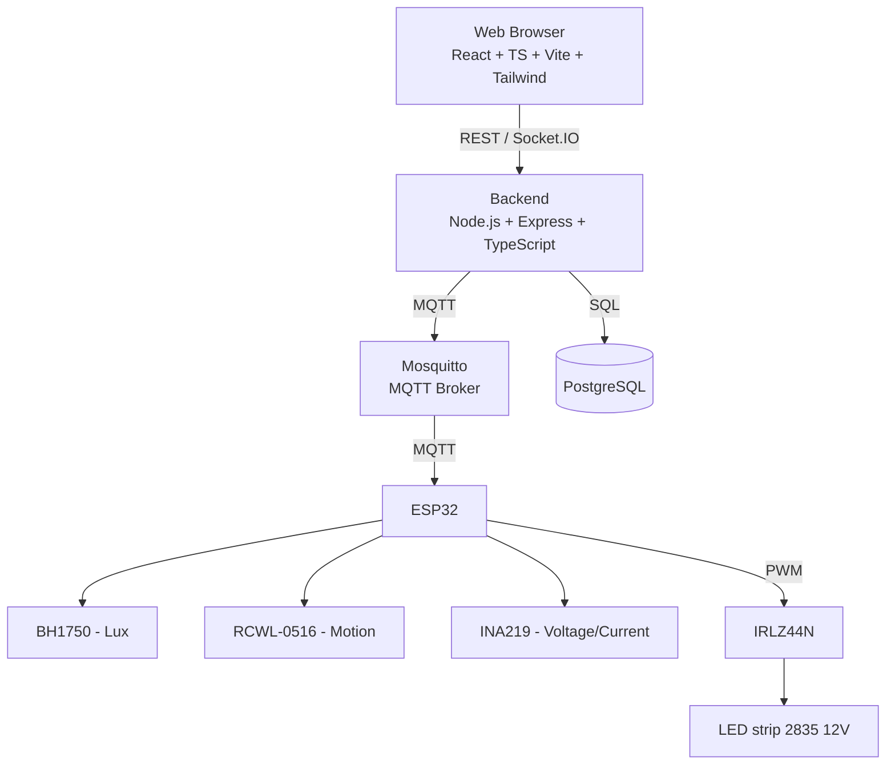
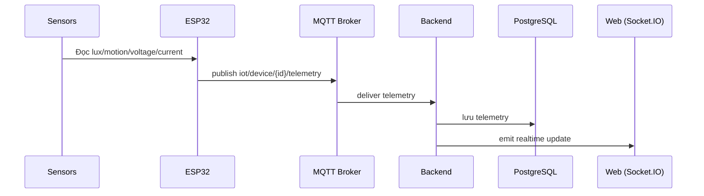
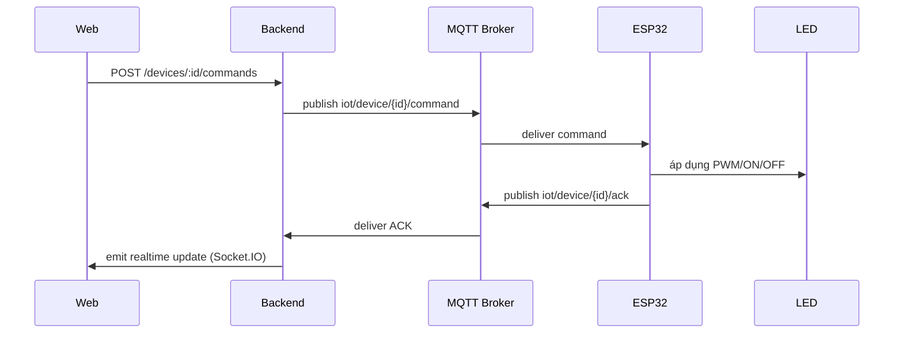
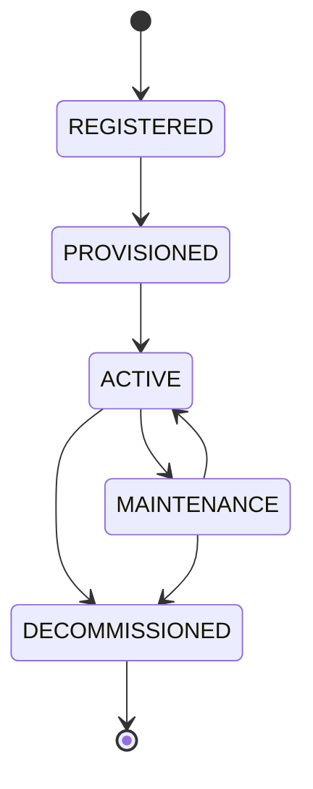

# ARCHITECTURE — Smart Lighting System

> Tài liệu này mô tả **HOW** hệ thống được tổ chức ở mức kiến trúc. Không phải source code documentation — chi tiết implementation nằm trong code và các docs khác (`API_SPEC.md`, `DATABASE.md`).

## 1. Architecture Overview

Hệ thống sử dụng kiến trúc **modular monolith** (không chia thành microservice).

```text
Web Browser (React + TypeScript + Vite + Tailwind CSS)
   │  REST / Socket.IO
   ▼
Backend (Node.js + Express + TypeScript)
   │                    │
   │ MQTT                │ SQL
   ▼                    ▼
Mosquitto (MQTT Broker)   PostgreSQL (Database)
   │  MQTT
   ▼
ESP32
   ├─ BH1750 → Lux
   ├─ RCWL-0516 → Motion
   ├─ INA219 → Voltage / Current
   └─ PWM → IRLZ44N → LED 12V
```

- **PostgreSQL:** database quan hệ dùng cho dữ liệu quản lý (user, device, telemetry, command, alert, audit log); dùng kiểu JSONB cho `adaptive_config`.
- **Socket.IO:** chỉ dùng để đẩy dữ liệu thay đổi theo thời gian thực từ Backend đến Web (không dùng cho giao tiếp Backend ↔ ESP32).

## 2. Architecture Layers

| Layer | Mô tả |
|---|---|
| **Device / Hardware** | ESP32 + cảm biến (BH1750, RCWL-0516, INA219) + cơ cấu chấp hành (IRLZ44N + LED strip 2835 12V). |
| **IoT Communication** | MQTT qua Mosquitto Broker, mô hình publish/subscribe giữa ESP32 và Backend. |
| **Backend** | Node.js + Express + TypeScript: xử lý nghiệp vụ, auth/RBAC, quản lý user/device, xử lý telemetry, xử lý command, alert engine, MQTT client, Socket.IO server. |
| **Database** | PostgreSQL: lưu trữ toàn bộ dữ liệu quản lý và vận hành. |
| **Frontend** | React + TypeScript + Vite + Tailwind CSS: giao diện Web, dashboard, biểu đồ (Recharts). |
| **Deployment** | Docker Compose hỗ trợ triển khai môi trường (Backend, Mosquitto, PostgreSQL...). |

## 3. Technology Stack

| Lớp | Công nghệ |
|---|---|
| MCU | ESP32 |
| Firmware | C++ / PlatformIO / Arduino Framework |
| IoT Protocol | MQTT |
| MQTT Broker | Mosquitto |
| Backend | Node.js 24 LTS / Express 5 / TypeScript |
| MQTT client (backend) | MQTT.js |
| Database | PostgreSQL 18 |
| Authentication | JWT |
| Password Hash | bcryptjs |
| Frontend | React / TypeScript / Vite |
| UI | Tailwind CSS |
| Chart | Recharts |
| Realtime | Socket.IO |
| Deployment | Docker Compose |
| Version Control | Git / GitHub |

> Không tự thay thế công nghệ trong bảng trên khi thực hiện task.

## 4. Hardware Architecture

| Linh kiện | Vai trò |
|---|---|
| ESP32 | MCU + Wi-Fi + MQTT client |
| BH1750 (GY-302) | Đo cường độ ánh sáng (Lux) |
| RCWL-0516 | Phát hiện chuyển động |
| INA219 (MCU-219) | Đo điện áp, dòng điện, công suất |
| IRLZ44N | Điều khiển PWM cho tải LED |
| LED strip 2835 12V | Cơ cấu chấp hành (đèn) |
| Nguồn 12V 3A | Cấp nguồn cho LED và mạch buck |
| Mini 560 Pro – 5V | Hạ áp 12V xuống 5V để cấp nguồn cho ESP32 |

**Kết nối ở mức kiến trúc:**

```text
ESP32 ↔ (I2C/GPIO) BH1750 / RCWL-0516 / INA219
ESP32 → (PWM) → IRLZ44N → LED strip 2835 12V
Nguồn 12V 3A → LED strip, và → Mini 560 Pro (hạ 5V) → ESP32
```

Sơ đồ nối dây chi tiết: **TODO** (báo cáo gốc đánh dấu "[CHÈN SƠ ĐỒ KHỐI PHẦN CỨNG / SƠ ĐỒ NỐI DÂY]" — chưa có).

## 5. Software Components

| Component | Trách nhiệm |
|---|---|
| **Firmware (ESP32)** | Đọc cảm biến, thực hiện Adaptive Lighting cục bộ, publish telemetry, subscribe command, gửi ACK, heartbeat, tự reconnect khi mất mạng. |
| **MQTT Broker (Mosquitto)** | Trung gian publish/subscribe giữa ESP32 và Backend. |
| **Backend** | Trung tâm xử lý nghiệp vụ: Auth/RBAC, User Management, Device Management, Telemetry Processing, Command Processing, Alert Engine, MQTT Client, Socket.IO server. Là thành phần **duy nhất** truy cập PostgreSQL. |
| **Database (PostgreSQL)** | Lưu trữ user, device, telemetry, command, alert, audit log. |
| **Frontend** | Giao diện Web: dashboard, điều khiển, lịch sử, cảnh báo. Chỉ giao tiếp với Backend qua REST/Socket.IO, **không** truy cập trực tiếp PostgreSQL hoặc MQTT Broker. |
| **Realtime layer (Socket.IO)** | Đẩy cập nhật dữ liệu thay đổi theo thời gian thực từ Backend đến Web. |

### Nguyên tắc kiến trúc (bắt buộc tuân thủ)

- Frontend chỉ giao tiếp với Backend, không truy cập trực tiếp PostgreSQL hoặc MQTT Broker.
- Backend là trung tâm xử lý nghiệp vụ.
- ESP32 giao tiếp với Backend thông qua MQTT Broker (không giao tiếp trực tiếp REST với backend).
- Backend là thành phần duy nhất truy cập PostgreSQL.
- Adaptive Lighting được thực hiện **trên ESP32** để giảm độ trễ và vẫn hoạt động được khi Internet/Backend tạm thời mất kết nối.
- Backend chịu trách nhiệm lưu dữ liệu, quản lý thiết bị, cấu hình, cảnh báo và kiểm soát quyền.
- Socket.IO chỉ dùng để đẩy dữ liệu thay đổi theo thời gian thực từ Backend đến Web.

## 6. Data Flows

### 6.1 Telemetry Flow

```text
Sensor → ESP32 → MQTT → Backend → PostgreSQL → Socket.IO → Web
```

### 6.2 Command Flow

```text
Web → Backend → MQTT → ESP32 → LED → ACK → Backend → Web
```

### 6.3 Alert Flow

- **DEVICE_OFFLINE:** phát sinh khi heartbeat của thiết bị bị timeout (thiết bị không gửi status/telemetry trong khoảng thời gian quy định — khoảng thời gian cụ thể: `TODO`).
- **LAMP_FAULT:** backend tạo cảnh báo khi đèn được yêu cầu bật nhưng dòng điện đo được (từ INA219, qua telemetry) thấp hơn ngưỡng trong một khoảng thời gian xác định. Ngưỡng và khoảng thời gian cụ thể: `TODO` (báo cáo chưa định lượng).
- Quy trình xử lý cảnh báo (acknowledge/resolve) sau khi tạo: thực hiện qua API `/alerts/:id/acknowledge` và `/alerts/:id/resolve` — xem `API_SPEC.md`.

Cơ chế retry/timeout/xử lý bản tin trùng cho luồng MQTT: mục 3.2.8 của báo cáo gốc chỉ có tiêu đề, chưa có nội dung → `TODO/UNDEFINED`.

## 7. Adaptive Lighting

Adaptive Lighting là logic tự động chạy **trên ESP32**, điều chỉnh PWM của LED dựa trên hai tín hiệu đầu vào: `motion` (có/không người) và `lux` (cường độ ánh sáng môi trường).

**Bảng ngưỡng PWM tham khảo (theo báo cáo gốc):**

| Điều kiện | PWM tham khảo |
|---|---|
| Không có người | 0–20% |
| Có người + Lux > 400 | 30% |
| Có người + Lux 200–400 | 50% |
| Có người + Lux 100–200 | 70% |
| Có người + Lux < 100 | 100% |

- Các ngưỡng trên được lưu trong trường `adaptive_config` (kiểu JSONB, trong bảng `DEVICE`).
- Ngưỡng có thể được thay đổi từ Backend, chỉ bởi **Admin** (qua `PATCH /devices/:id/config`).
- Không tự thay đổi các giá trị ngưỡng nêu trên khi implement — đây là giá trị tham khảo từ thiết kế gốc, thay đổi thực tế phải qua `adaptive_config`, không hard-code lại trong logic khác.

## 8. Device Lifecycle

```text
REGISTERED → PROVISIONED → ACTIVE → MAINTENANCE → DECOMMISSIONED
```

| Trạng thái | Ý nghĩa |
|---|---|
| REGISTERED | Thiết bị đã được đăng ký |
| PROVISIONED | Đã được cấp thông tin nhận dạng/xác thực (credential) |
| ACTIVE | Đang hoạt động |
| MAINTENANCE | Đang bảo trì |
| DECOMMISSIONED | Ngừng sử dụng / thu hồi kết nối |

**Phân biệt quan trọng:**

- `lifecycle_status` — trạng thái vòng đời quản lý (bảng trên): REGISTERED, PROVISIONED, ACTIVE, MAINTENANCE, DECOMMISSIONED.
- `device_status` — trạng thái hoạt động hiện tại: ONLINE, OFFLINE, FAULT. Đây **không phải** là lifecycle_status.

Hai trường này độc lập và đều tồn tại trong bảng `DEVICE` (xem `DATABASE.md`).

## 9. Authentication and Authorization Architecture

- **Authentication:** JWT được sử dụng để xác thực API. Mật khẩu người dùng được băm bằng **bcryptjs**, không lưu plaintext.
- **Authorization (RBAC):** ba vai trò — Admin, Operator, Viewer. Backend kiểm tra RBAC **tại API** (không chỉ ẩn nút trên giao diện frontend).
- **Device identity:** mỗi thiết bị có `device_id` và `credential_hash` riêng để xác thực kết nối MQTT.
- **Secret management:** credential/secret được lưu qua biến môi trường hoặc cơ chế cấu hình an toàn, không commit lên GitHub.
- **Audit:** các thao tác quan trọng được ghi vào `audit_logs`.
- Thiết bị bị khóa/revoke/decommission không được tiếp tục hoạt động hợp lệ trên hệ thống.
- Kết nối triển khai thực tế cần sử dụng HTTPS/TLS khi phù hợp (chưa bắt buộc ở giai đoạn prototype — xem hướng phát triển).

Ma trận quyền chi tiết theo Use Case: xem `PRD.md` mục Business Rules.

## 10. Architecture Diagrams

### 10.1 System Architecture



### 10.2 Telemetry Data Flow



### 10.3 Command Flow



### 10.4 Device Lifecycle



> Lưu ý: báo cáo gốc chỉ nêu chuỗi tuyến tính `Registered → Provisioned → Active → Maintenance → Decommissioned`. Việc quay lại từ MAINTENANCE về ACTIVE là suy luận hợp lý cho một trạng thái "bảo trì", nhưng **chưa được báo cáo xác nhận rõ ràng** → cần xác nhận với nhóm trước khi implement transition ngược.
